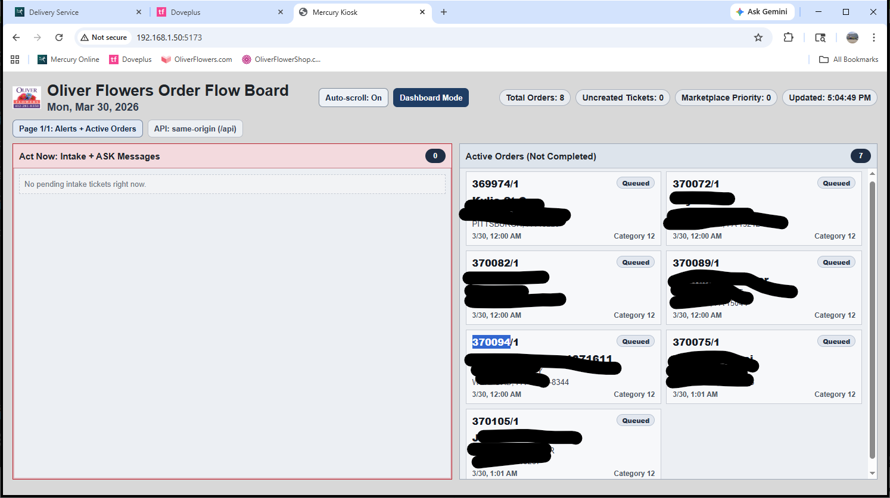

# Mercury Kiosk App (Rotating Horizontal Board)

This scaffold renders a kiosk-oriented board on a gray background with:

- Horizontal lanes
- Fewer operational groupings
- Two-page auto-rotation
- High-visibility flashing alerts for inbound tickets not yet created as orders
- Extra urgency styling for Uber Eats / DoorDash signals



## Layout

- Two rotating pages
- Gray background
- Horizontal lanes and card stacks
- Alerts page:
  - Tickets not yet converted to orders
  - Needs action (incoming + not designed)
- Flow page:
  - In production
  - Out for delivery
  - Completed / exception

## Data Sources

- `GET /api/workflow/events-now`
- `GET /api/workflow/undelivered-orders`
- `GET /api/workflow/ticket-status/:ticketId`
- `GET /api/workflow/order-lifecycle/:ticketId`

Default API base URL:

- Same-origin `/api` (recommended for multi-computer access)

Override with:

- `VITE_WORKFLOW_BASE_URL`

Dev proxy target (when running `npm run dev`):

- `VITE_WORKFLOW_PROXY_TARGET` (set this to your real workflow API host, e.g. `http://192.168.1.50`)

## Run (when Node/npm are available)

```bash
cd pi-kiosk-dashboard-starter/kiosk-app
npm install
npm run dev -- --host
```

## One-Command MVP Boot

From `pi-kiosk-dashboard-starter`:

- Windows PowerShell: `.\start-mvp.ps1`
- Windows cmd: `start-mvp.cmd`
- Linux/macOS: `./start-mvp.sh`

## One-Command Live Boot (Real Mercury)

Set either:

- `WORKFLOW_API_BASE_URL` for a direct JSON workflow API host (example: `http://192.168.1.50`)
- or `MERCURY_BASE_URL` for SOAP host mode (bridge auto-starts)

Then run:

- Windows PowerShell: `.\start-live-mvp.ps1`
- Windows cmd: `start-live-mvp.cmd`
- Linux/macOS: `./start-live-mvp.sh`

## Troubleshooting

If the UI shows API connection errors:

1. Confirm launcher was run from `pi-kiosk-dashboard-starter` (not `kiosk-app`).
2. If using `npm run dev`, confirm the proxy target host is reachable from the dev machine:
   - Example: `http://<WORKFLOW_API_BASE_URL>/api/workflow/events-now`
3. If needed, run:
   - `cd ..`
   - `.\start-live-mvp.cmd`

The Windows launchers now use `npm.cmd` to avoid PowerShell `npm.ps1` execution-policy issues.
