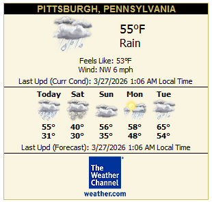
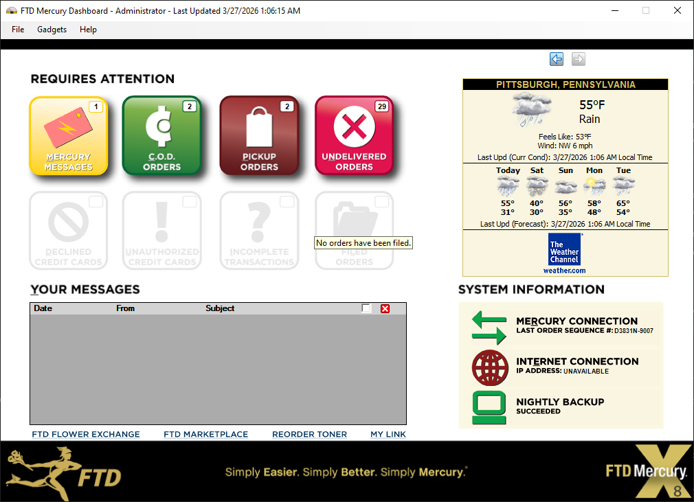

# Weather Widget Shim (XOAP Compatibility)


| Overview | Preview |
| --- | --- |
| This folder contains a local IIS-hosted compatibility shim for legacy Weather.com XOAP calls used by the Mercury dashboard weather gadget. |  |

## Why This Exists

`WaFTDDashboard.dll` still calls endpoints shaped like:

- `http://xoap.weather.com/search/search?where=...`
- `http://xoap.weather.com/weather/local/<loc>?cc=*&dayf=5&prod=xoap&par=...&key=...`

The old XOAP backend is no longer available, so this shim emulates the XML contract while sourcing live weather data from Open-Meteo.

## Screenshot in Dashboard



## What It Implements

- `GET /search/search?where=<query>`
- `GET /weather/local/<locationToken>?cc=*&dayf=5&prod=xoap&par=...&key=...[&unit=m]`

Response format is Weather.com-style XML with key nodes expected by the dashboard parser:

- `/weather/loc/dnam`
- `/weather/cc/tmp`
- `/weather/cc/icon`
- `/weather/cc/t`
- `/weather/cc/flik`
- `/weather/cc/wind/s`
- `/weather/cc/wind/t`
- `/weather/dayf/day[@d]/...`
- `/weather/dayf/lsup`

## Repo Layout

- `site/web.config` - IIS wildcard handler wiring
- `site/App_Code/WeatherShimHandler.cs` - runtime-compiled ASP.NET handler
- `scripts/install-weather-xoap-shim.ps1` - install/update IIS + hosts entry
- `scripts/uninstall-weather-xoap-shim.ps1` - remove IIS + hosts entry
- `scripts/smoke-test-weather-xoap-shim.ps1` - post-install verification
- `scripts/set-mercury-weather-gadget-url.ps1` - update `DashboardWeatherGadgetURL` in client `Mercury.xml`
- `scripts/*.cmd` - wrappers that launch scripts with `-ExecutionPolicy Bypass`

## Install (Admin PowerShell)

```powershell
cd .\weather-widget-shim\scripts
.\install-weather-xoap-shim.ps1
```

The install script now auto-checks/enables IIS + ASP.NET prerequisites unless you pass `-SkipIisPrereqs`.
If Windows requires a reboot to finish enabling those features, the install completes in a "pending restart" state and tells you to reboot, then run the smoke test script.
Smoke checks are best-effort during install (the shim still installs even if upstream weather APIs are temporarily unreachable).

If your workstation blocks `.ps1` execution, use either method below:

```powershell
Set-ExecutionPolicy -Scope Process -ExecutionPolicy Bypass -Force
.\install-weather-xoap-shim.ps1
.\smoke-test-weather-xoap-shim.ps1
```

or:

```powershell
.\install-weather-xoap-shim.cmd
.\smoke-test-weather-xoap-shim.cmd
```

Default install behavior:

1. copies site files to `C:\FTDTools\XoapWeatherShim\site`
2. creates IIS app pool `FTD.XoapWeatherShim` (.NET v4 integrated)
3. creates IIS site `FTD.XoapWeatherShim` with host binding `*:80:xoap.weather.com`
4. adds hosts entry: `127.0.0.1 xoap.weather.com`
5. runs endpoint smoke checks

## Uninstall

```powershell
cd .\weather-widget-shim\scripts
.\uninstall-weather-xoap-shim.ps1 -RemoveInstallRoot
```

If script policy blocks `.ps1`:

```powershell
.\uninstall-weather-xoap-shim.cmd -RemoveInstallRoot
```

## Mercury Wiring Notes

For the dashboard to use local gadget code, confirm `DashboardWeatherGadgetURL` points to the local page:

- `http://localhost/WaFTDDashboard/WeatherGadget.aspx`

Client rollout helper (example for server host `192.168.1.50`):

```powershell
cd .\weather-widget-shim\scripts
.\set-mercury-weather-gadget-url.ps1 -HostName 192.168.1.50
```

or use wrapper:

```powershell
.\set-mercury-weather-gadget-url.cmd -HostName 192.168.1.50
```

Default path detection order:

1. `C:\Program Files (x86)\Wings\Mercury.xml`
2. `C:\Wings\Mercury.xml`

The script creates a timestamped backup before writing.

Then the weather control's internal XOAP calls to `xoap.weather.com` will be served by this local shim.

## Windows Installer + Release Workflow

This repo now includes a Windows `.exe` installer flow for the shim:

- Workflow: `.github/workflows/weather-widget-shim-release.yml`
- Installer output: `weather-widget-shim/dist/FTD.WeatherXoapShim.Setup.<version>.exe`

Supported installer switches:

- `/SITENAME=FTD.XoapWeatherShim`
- `/HOSTNAME=xoap.weather.com`
- `/INSTALLROOT=C:\FTDTools\XoapWeatherShim`
- `/SKIPHOSTSENTRY=false`
- `/SKIPIISPREREQS=false` (default keeps install easy on new computers)
- `/REMOVEINSTALLROOT=false` (used on uninstall)

## Data Source

- Geocoding API: `https://geocoding-api.open-meteo.com/`
- Forecast API: `https://api.open-meteo.com/`

No API key is required for current usage.

